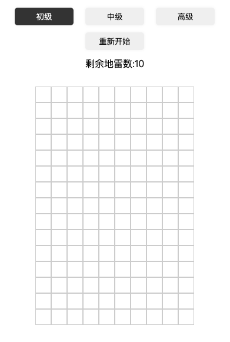

# 扫雷小游戏

### 2020/9月更新
【 升级为vue-cli构建,老版本废除 】
【 升级为typescript 版本 】

````
npm install
npm start
````
### 游戏介绍


### 原理和实现
#### 使用平铺算法布置雷
- 生成两个数组,一个为安全的,一个为雷数组,总和等于,三个级别的 row * col的值; 
- 将生成的数组进行洗牌(minShuffle洗牌算法)，单选顺序,最后裂成二维数组
- 计算块距离每个雷的数目
- 根据点击的内容打开相应的地区，如果是0则打开周围没有雷的地区，如果是数字则直接展示数字,如过是9则为雷，游戏结束
